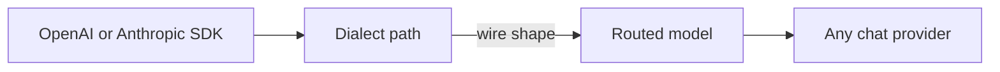

# API dialects

Point your **existing** OpenAI or Anthropic client at AFI. The path you call selects the **client wire format** (the dialect). Routing selects **which upstream model** serves the request. Those two choices are independent.



| You want to use… | Call AFI at… | Auth |
| ---------------- | ------------ | ---- |
| OpenAI SDK / `chat.completions` | `/openai/v1/...` (or `/v1/...`) | `Authorization: Bearer <virtual-key>` |
| Anthropic SDK / Messages | `/anthropic/v1/...` (or `/v1/messages`) | `x-api-key: <virtual-key>` or Bearer |

The virtual API key is always an **AFI** key from the platform — not the upstream vendor key. Upstream credentials stay on the provider config (BYOK / env / vault).

## Why dialects matter

Without dialects, gateways usually force one client shape (almost always OpenAI). Teams stuck on Anthropic SDKs or tooling cannot reuse the same gateway routes for Gemini or OpenAI backends.

With dialects:

* Keep your preferred SDK and prompts
* Route `"model"` to OpenAI, Anthropic, Gemini, or `openai_compatible` (Ollama, etc.)
* Still get AFI auth, quotas, policies, failover, usage, and hooks

## Paths

| Dialect | Canonical | Alias |
| ------- | --------- | ----- |
| OpenAI chat | `POST /openai/v1/chat/completions` | `POST /v1/chat/completions` |
| OpenAI models | `GET /openai/v1/models` | `GET /v1/models` |
| Anthropic messages | `POST /anthropic/v1/messages` | `POST /v1/messages` |

Embeddings, TTS, STT, and images remain on `/v1/*` only for now (OpenAI-shaped). Chat is the dialect MVP.

Full path map: [Gateway API](gateway.md).

## OpenAI SDK

```bash
export OPENAI_BASE_URL=http://localhost:8080/openai/v1
# legacy alias also works:
# export OPENAI_BASE_URL=http://localhost:8080/v1
export OPENAI_API_KEY=sk-your-afi-virtual-key
```

```python
from openai import OpenAI

client = OpenAI()  # reads OPENAI_BASE_URL + OPENAI_API_KEY
resp = client.chat.completions.create(
    model="gpt-4o-mini",  # AFI route name
    messages=[{"role": "user", "content": "ping"}],
)
print(resp.choices[0].message.content)
```

## Anthropic SDK

Set the base URL to the gateway **host + `/anthropic`**. The SDK appends `/v1/messages` and sends `x-api-key`.

```bash
export ANTHROPIC_BASE_URL=http://localhost:8080/anthropic
export ANTHROPIC_API_KEY=sk-your-afi-virtual-key
```

```python
import anthropic

client = anthropic.Anthropic()
msg = client.messages.create(
    model="gpt-4o-mini",  # still an AFI route — can target OpenAI upstream
    max_tokens=1024,
    messages=[{"role": "user", "content": "Hello"}],
)
print(msg.content[0].text)
```

Curl equivalent:

```bash
curl -s http://localhost:8080/anthropic/v1/messages \
  -H "content-type: application/json" \
  -H "x-api-key: sk-your-afi-virtual-key" \
  -H "anthropic-version: 2023-06-01" \
  -d '{
    "model": "gpt-4o-mini",
    "max_tokens": 1024,
    "messages": [{"role": "user", "content": "Hello"}]
  }'
```

## Model names are routes

`"model"` is the **AFI route alias** configured in the platform (Routing), not necessarily the upstream vendor id. Map `gpt-4o-mini` → OpenAI, or `claude-sonnet` → Anthropic, or point an Anthropic-shaped client at an OpenAI route — the dialect stays Anthropic; the provider follows the route.

## Streaming

Both dialects support streaming when the routed provider advertises `stream` capability. AFI translates stream events so the client still sees OpenAI SSE chunks or Anthropic message events.

## Limits (MVP)

Chat dialects cover the common text path (messages, system, max tokens, temperature, stop). Features that do not round-trip cleanly — tool calls, vision parts, Anthropic `thinking`, OpenAI `logprobs` — may be dropped or rejected with `400`. See the engineering note [`dialect-api-ir.md`](../../internal-docs/dialect-api-ir.md) for the lossy map and IR details.

## Related

* [Gateway overlay](gateway.md) — full path and auth reference
* [Providers](../development/providers.md) — adapter capabilities
* [Verify](../getting-started/verify.md) — local smoke checks
