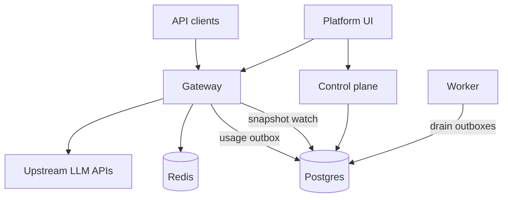

# Deployment

AFI ships as **Go binaries** (control plane, gateway, worker, CLI) plus an optional **static web UI**. Local development remains the fastest path for contributors; this section covers self-hosted deployments.

## Architecture



| Component | Role | Required? |
|-----------|------|-----------|
| **Postgres 16+** | Metadata, snapshots, outboxes, total quotas | Yes |
| **Control plane** | Migrate, seed, platform APIs, snapshot publish | Yes |
| **Gateway** | Inference pipeline (auth → quotas → policies → providers) | Yes |
| **Worker** | Drain usage (and optional platform events) outboxes | Recommended |
| **Redis 7+** | Timed quota windows (`minute` / `hour` / `day`) | If you use timed quotas |
| **Web UI** | Platform console + playground | Optional |
| **NATS / Kafka** | Platform domain event brokers | Optional |

## Choose a path

| Path | When to use | Guide |
|------|-------------|-------|
| **Docker Compose** | Single host / VM, quick self-host | [Docker Compose](deployment/docker.md) |
| **Binaries** | Custom OS images, systemd, bare metal | [Binary deployment](deployment/binary.md) |
| **Local dev** | Day-to-day development | [Local development](getting-started/local-dev.md) |

## Customization

Every config knob operators can change — YAML, environment variables, seed values, provider secrets, web build args, and runtime limits — is documented in:

**[Customization reference](deployment/customization.md)**

Also see the shorter [Config reference](development/config-reference.md) for day-to-day development.

## Security checklist

Before exposing AFI beyond localhost:

1. Replace all `CHANGE_ME` values in `deploy/.env` and `deploy/afi.yaml` (or your own config).
2. Set strong `AFI_JWT_SECRET` and `AFI_INTERNAL_TOKEN` (never use the local-dev defaults).
3. Use a strong Postgres password and restrict network access to the database.
4. Inject upstream provider API keys only into the **gateway** process environment.
5. Change seed admin password and virtual API key (or delete the seed key after creating your own).
6. Put TLS termination (reverse proxy / load balancer) in front of control plane, gateway, and web.
7. Prefer private networking between services; only publish the ports clients need.

## Health checks

| Service | Endpoint |
|---------|----------|
| Control plane | `GET /healthz` → `{"status":"ok"}` |
| Gateway | `GET /healthz` → status + `snapshot_version` + extensions |
| Web (Compose image) | `GET /healthz` |
| Worker | No HTTP probe — monitor process / logs |

```bash
make deploy-health
# or
AFI_CONTROLPLANE_URL=https://cp.example AFI_GATEWAY_URL=https://gw.example \
  bash scripts/deploy-health.sh
```

## Related

* [Platform domain events](development/platform-events.md)
* [Providers](development/providers.md)
* [Architecture](development/architecture.md)
