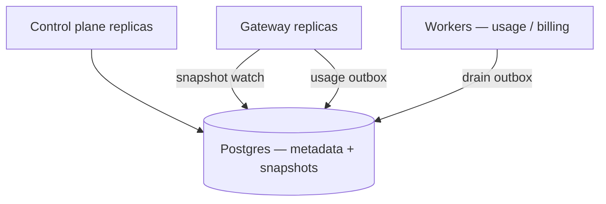

# Deployment

Local development is the supported path today. See [Local development](getting-started/local-dev.md).

## Production (planned)

A production deployment will typically run:

* Control plane replicas (stateless HTTP + Postgres)
* Gateway replicas (stateless HTTP + snapshot watch against shared store)
* Postgres (primary metadata + snapshots)
* Optional workers for usage/billing consumers

Container images and Kubernetes manifests are not shipped yet. Prefer Compose for local, and treat binary layout (`cmd/controlplane`, `cmd/gateway`) as the deployment unit.
