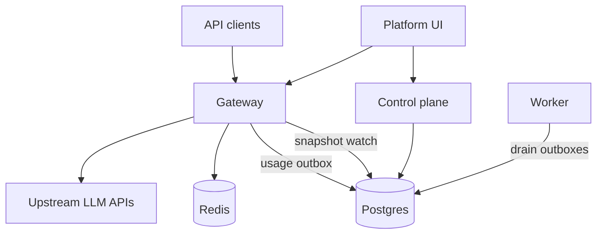

# Deployment

AFI ships as **Go binaries** (control plane, gateway, worker, CLI) plus an optional **static web UI**. Local development remains the fastest path for contributors; this section covers self-hosted deployments.

## Architecture



| Component | Role | Required? |
|-----------|------|-----------|
| **Postgres 16+** | Metadata, snapshots, outboxes, total quotas | Yes |
| **Control plane** | Migrate, seed, platform APIs, snapshot publish | Yes |
| **Gateway** | Inference pipeline (auth → quotas → policies → providers) | Yes |
| **Worker** | Drain usage (and optional platform events) outboxes | Recommended |
| **Redis 7+** | Timed quota windows (`minute` / `hour` / `day`) | If you use timed quotas |
| **Web UI** | Platform console + playground | Optional |
| **NATS / Kafka** | Platform domain event brokers | Optional |

## Hub-and-spoke (multi-region gateways)

Single control plane (hub) can manage gateway deployments in multiple regions with **org–region bindings** and optional **full config overlays**:

1. Platform admin (`users.role=admin`) creates a **region** and registers a **gateway deployment** in the UI (**Regions**) or Platform API. Save the join token.
2. Bind organizations to each region (`POST …/regions/{id}/organizations`). Unbound orgs are omitted from that region’s snapshot. Optionally attach a **full overlay** (`PUT …/overlay`) to replace that org’s gateway config slice in the region (inherit base when no overlay).
3. **Hub:** enable snapshot fan-out with `AFI_SNAPSHOT_DIST_ENABLED=true` and `AFI_SNAPSHOT_S3_*` (S3-compatible bucket). Publishes a global blob plus per-region blobs under `{prefix}/{regionSlug}/`.
4. **Spoke gateway:** set `AFI_SNAPSHOT_BACKEND=objectstore`, the same `AFI_SNAPSHOT_S3_*`, plus:
   - `AFI_REGION_ID` — **region slug** (selects `snapshots/{slug}/…` and stamps usage tags)
   - `AFI_CONTROL_PLANE_URL` — hub control plane base URL
   - `AFI_DEPLOYMENT_ID` / `AFI_DEPLOYMENT_JOIN_TOKEN`
   - `AFI_USAGE_BACKEND=http` when the spoke does not share hub Postgres
   - `AFI_REDIS_URL` — **regional** Redis for timed quotas
5. Lifetime (`total`) quotas still need hub Postgres on the spoke (or fail closed when omitted). Timed windows are independent per regional Redis. Overlay limit changes apply to the regional snapshot; total budgets remain global unless counter namespaces are regionalized later.

Shared-DB single-region deploy remains the default (`AFI_SNAPSHOT_BACKEND=postgres`) and does not require org bindings for local use.

For single-region installs that later enable object-store spokes, bind every org once:

```bash
afi regions bind-all <region-slug-or-id>
# or: POST /api/v1/platform/regions/{id}/organizations/bind-all
```

## Hub and regional control planes (federation pull sync)

Run a **home** control plane (source of truth for orgs, memberships, and overlays) and optional **regional** control planes that pull configuration for one region:

| Role | Env | Behavior |
|------|-----|----------|
| Single CP (default) | `AFI_FEDERATION_MODE=off` | Unchanged Phase 2 single control plane |
| Home (hub) | `AFI_FEDERATION_MODE=home` | Platform **Federation** UI / API to register peers; export APIs enabled |
| Regional | `AFI_FEDERATION_MODE=regional` plus hub URL, join token, region slug | Pull loop applies memberships/overlays and stores the compiled regional snapshot locally |

Regional CP settings:

- `AFI_FEDERATION_HUB_URL` — home control plane base URL
- `AFI_FEDERATION_JOIN_TOKEN` — token from peer registration (shown once)
- `AFI_FEDERATION_REGION_SLUG` — region slug the peer is scoped to
- `AFI_FEDERATION_PULL_INTERVAL` — default `30s`
- Regional gateway: `AFI_SNAPSHOT_BACKEND=postgres` against the regional Postgres (or object store as today)

Register peers as platform admin under **Federation** (or `POST /api/v1/platform/federation/peers`). Mesh peers, quota CRDTs, and geo-routing remain out of scope.

**Local lab:** [examples/federation](../../examples/federation/README.md) runs a hub CP + regional CP + two gateways with `./up.sh` (creates regions, bind-all, peer, and deployments for you).

## Choose a path

| Path | When to use | Guide |
|------|-------------|-------|
| **Quick start** | Try AFI locally with one command | [Quick start](../guides/quick-start.md) |
| **Docker Compose** | Single host / VM, or profile subsets (control plane, data plane, worker, web) | [Docker Compose](docker.md) |
| **Federation lab** | Hub + regional CPs and two gateways on one machine | [examples/federation](../../examples/federation/README.md) |
| **Binaries** | Custom OS images, systemd, bare metal | [Binary deployment](binary.md) — download `v*` release archives or build with `make build-release` |
| **Local dev** | Day-to-day development | [Local development](../development/local-dev.md) |

## Customization

Every config knob operators can change — YAML, environment variables, seed values, provider secrets, web build args, and runtime limits — is documented in:

**[Customization reference](customization.md)**

Also see the shorter [Config reference](../development/config-reference.md) for day-to-day development.

## Security checklist

Before exposing AFI beyond localhost:

1. Replace all `CHANGE_ME` values in `deploy/.env` and `deploy/afi.yaml` (or your own config).
2. Set strong `AFI_JWT_SECRET` and `AFI_INTERNAL_TOKEN` (never use the local-dev defaults).
3. If enabling platform SSO, set `auth.public_base_url` / `mail.public_app_url` to public HTTPS URLs, use `auth.sso.state_store: redis`, and keep IdP client secrets out of git ([SSO guide](../guides/sso.md)).
4. Use a strong Postgres password and restrict network access to the database.
5. Inject upstream provider API keys only into the **gateway** process environment.
6. Change seed admin password and virtual API key (or delete the seed key after creating your own).
7. Put TLS termination (reverse proxy / load balancer) in front of control plane, gateway, and web.
8. Prefer private networking between services; only publish the ports clients need.

## Health checks

| Service | Endpoint |
|---------|----------|
| Control plane | `GET /healthz` → `{"status":"ok"}` |
| Gateway | `GET /healthz` → status + `snapshot_version` + extensions |
| Web (Compose image) | `GET /healthz` |
| Worker | No HTTP probe — monitor process / logs |

```bash
make deploy-health
# or
AFI_CONTROLPLANE_URL=https://cp.example AFI_GATEWAY_URL=https://gw.example \
  bash scripts/deploy-health.sh
```

## Related

* [Single sign-on (SSO)](../guides/sso.md)
* [Platform domain events](../development/platform-events.md)
* [Providers](../development/providers.md)
* [Architecture](../development/architecture.md)
