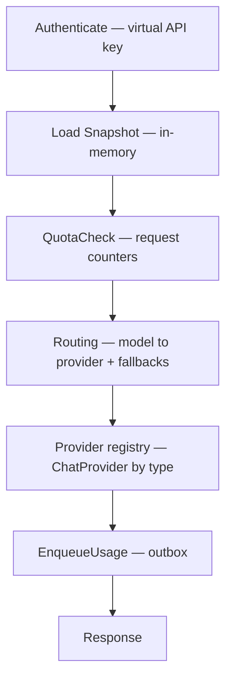

# Architecture

AFI separates **control plane** and **data plane**.

## Principles

1. The control plane owns business rules.
2. The data plane only executes requests.
3. Configuration is immutable at runtime (snapshots).
4. Every request completes without configuration database access (counters/outbox are operational state, not config).
5. Performance and operational simplicity take precedence over architectural purity.
6. New providers register through a stable adapter contract without editing the request pipeline core.

## Control plane

Uses pragmatic domain packages.

Responsibilities today:

* Persist orgs, projects, users, virtual API keys, providers, routes, quotas
* Create organizations and invite existing users by email (org membership roles: owner / admin / member)
* API keys: **personal** (user-scoped) and **service_account** (org- or project-scoped)
* Compile configuration into versioned snapshots (including provider capabilities)
* Platform HTTP APIs (`/api/v1/platform/*`)
* Internal admin (`/internal/v1/*`, `/healthz`)

## Data plane

Implemented as a **request pipeline**:

Provider adapters (`openai`, `anthropic`, `gemini`, `openai_compatible`, …) implement `ChatProvider` and register in a registry. Optional modality ports (`AudioBackend`, `MessagesBackend`) are exposed by the same adapters and resolved by routed `provider.type`. See [Providers](providers.md).

Also exposes:

* `GET /v1/models` — virtual models from the key’s organization routes, enriched from the curated model catalog (`mode`, context limits, `supports_streaming` / `supports_tts` / `supports_stt`)
* `POST /v1/chat/completions` — OpenAI-shaped chat via `ChatProvider` (adapters translate native APIs)
* `POST /v1/messages` — Anthropic-shaped pass-through via `MessagesBackend`
* `POST /v1/audio/speech` / `POST /v1/audio/transcriptions` — TTS/STT via `AudioBackend`
* `POST|GET|DELETE /mcp/{alias}` — MCP Streamable HTTP proxy to org-scoped upstream backends (snapshot `MCPBackends`). Platform UI: [MCP and A2A](../getting-started/web-ui/mcp-a2a.md).
* `POST /a2a/{alias}` — A2A JSON-RPC proxy; `GET /a2a/{alias}/.well-known/agent-card.json` — Agent Card with gateway URL rewrite (snapshot `A2AAgents`). Platform UI: [MCP and A2A](../getting-started/web-ui/mcp-a2a.md).

The playground honors streaming/TTS/STT capabilities per model. Chat failover retries only before the response body is committed to the client (audio has no failover in this build).

Pipeline stages stay stateless aside from the in-memory snapshot pointer. Quota counters and the usage outbox use Postgres as operational stores.

## Snapshots

Snapshots contain:

* Virtual API keys (hashes) → org binding, optional project, kind, owner user id
* Providers (type, base URL, API key env ref, capabilities)
* Provider credentials (env ref, encrypted_db ciphertext, or vault secret_ref) + assignments (provider type × org/project/api_key scope)
* Static model routes (optional fallbacks and retry config)
* Quotas (scope, metric, limit, window) — resolve order per window: api_key → user → project → organization
* CEL request policies (when/then: CEL when + ordered Then actions allow|deny|set_header|use_credential; vars include `request`, `key`, and `credential`)

Stored in Postgres (`gateway_snapshots`). The gateway watches for new versions (poll + `LISTEN/NOTIFY`) and hot-reloads.

## Async usage

The request path never waits on `usage_events` consumers. Run `make run-worker` locally to populate the Usage UI (including `cost_usd` when prices match). Events carry a `modality` (`chat` / `messages` / `tts` / `stt`, …) and a `metrics` JSON object for non-token quantities; token columns remain for chat pricing. Cost uses DB `model_prices` overrides when present, otherwise the curated catalog in `internal/modelcatalog` (chat $/MTok, TTS $/character, STT $/second).

## Extensions (current)

In-process registration is live:

* **Providers** — `sdk/provider.ChatProvider` via `Registry.RegisterSDK` (example: `extensions/echo`)
* **Hooks** — `BeforeCall` / `AfterCall` (all modalities) plus `BeforeChat` / `AfterChat`; tags via `X-AFI-Tags` (`extensions/demohook`; example-only tag limits in `extensions/tagquota`)
* **WASM hooks** — sandboxed TinyGo guests via `internal/adapters/wasm` + org `wasm_hooks` in the snapshot (`AFI_WASM_*` env still works for demos). See [WASM hooks](../hooks/wasm.md).
* **Provider health** — control-plane rollup from `usage_events` for Providers UI

Control-plane WASM hook bindings are available; gRPC plugin runtimes, billing invoices, and multi-region snapshot distribution remain future work.

**Protocol gateways:** MCP Streamable HTTP (`/mcp/{alias}`) and A2A JSON-RPC + Agent Card (`/a2a/{alias}`) proxies are shipped. See [`internal-docs/PROJECT.md`](../../internal-docs/PROJECT.md) §16 and [`internal-docs/mcp-a2a-gateway.md`](../../internal-docs/mcp-a2a-gateway.md).

**Shipped governance:**

* **Quotas** — `total` windows on Postgres; `minute` / `hour` / `day` rate limits on Redis (`AFI_REDIS_URL`)
* **CEL policies** — when/then rules in the snapshot. When the expression is true, Then `actions` run in order: `deny` stops with 403, `allow` short-circuits allow, `set_header` sets an outbound provider header, `use_credential` selects a secret by name. Credential context: `credential.is_byok`, `credential.id`, `credential.name`, `credential.storage_kind`, `credential.provider_type`.
* **Provider credentials (BYOK)** — org-owned secrets (`env`, AES-GCM `encrypted_db`, or `vault` refs). Assignable to organization, project, or API key scopes. **Policy override:** `use_credential` action picks a credential by **name**; otherwise resolve **api_key → project → org → provider `api_key_env`**. Usage events persist `credential_id` and `used_byok`.