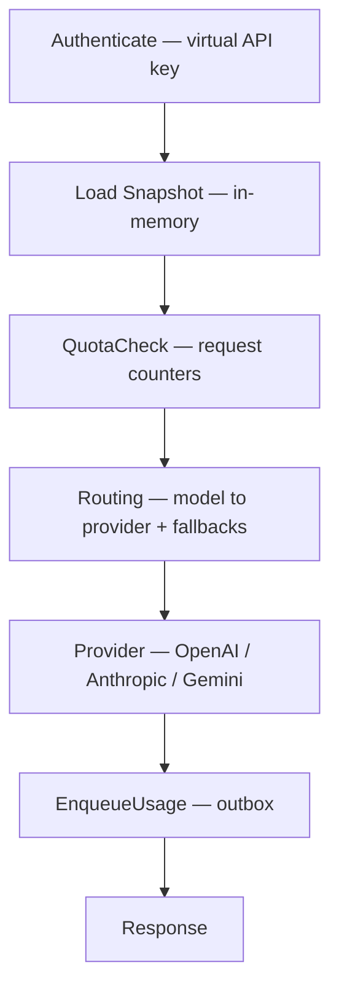
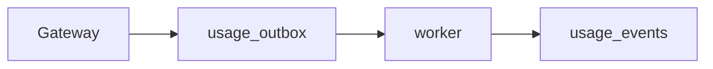

# Architecture

AFI separates **control plane** and **data plane**.

## Principles

1. The control plane owns business rules.
2. The data plane only executes requests.
3. Configuration is immutable at runtime (snapshots).
4. Every request completes without configuration database access (counters/outbox are operational state, not config).
5. Performance and operational simplicity take precedence over architectural purity.

## Control plane

Uses pragmatic domain packages (full DDD bounded contexts grow over time).

Responsibilities today:

* Persist orgs, projects, users, virtual API keys, providers, routes, quotas
* Compile configuration into versioned snapshots
* Platform HTTP APIs (`/api/v1/platform/*`)
* Internal admin (`/internal/v1/*`, `/healthz`)

## Data plane

Implemented as a **request pipeline**, not DDD:

Also exposes:

* `GET /v1/models` — virtual models from the key’s organization routes
* `POST /v1/chat/completions` — OpenAI-shaped chat (adapters translate Anthropic/Gemini)

Streaming: OpenAI and Anthropic return OpenAI-compatible SSE. Gemini is non-stream in the current release. Failover retries only before the response body is committed to the client.

Pipeline stages stay stateless aside from the in-memory snapshot pointer. Quota counters and the usage outbox use Postgres as operational stores.

## Snapshots

Snapshots contain:

* Virtual API keys (hashes) → project binding
* Providers (type, base URL, API key env ref)
* Static model routes (optional fallbacks)
* Quotas (scope, metric, limit)

Stored in Postgres (`gateway_snapshots`). The gateway watches for new versions (poll + `LISTEN/NOTIFY`) and hot-reloads.

## Async usage

The request path never waits on `usage_events` consumers. Run `make run-worker` locally to populate the Usage UI (including `cost_usd` when prices match).

## Future extensions

Plugin runtimes (gRPC / WASM), CEL policies, billing invoices, and multi-region snapshot distribution remain future work.
