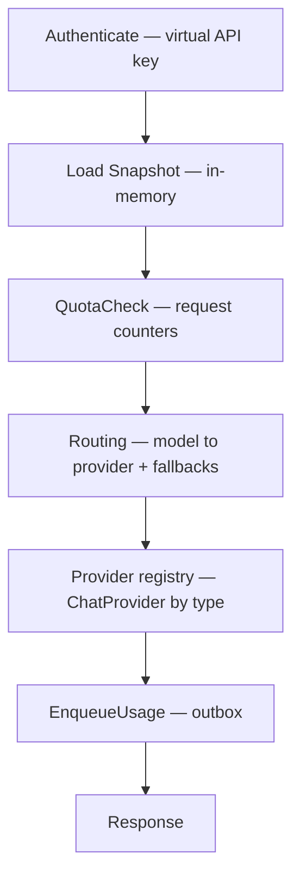
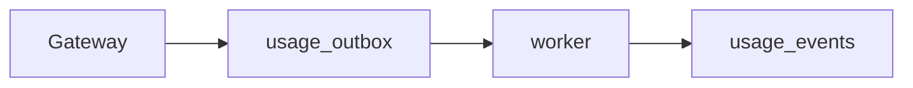

# Architecture

AFI separates **control plane** and **data plane**.

## Principles

1. The control plane owns business rules.
2. The data plane only executes requests.
3. Configuration is immutable at runtime (snapshots).
4. Every request completes without configuration database access (counters/outbox are operational state, not config).
5. Performance and operational simplicity take precedence over architectural purity.
6. New providers register through a stable adapter contract without editing the request pipeline core.

## Control plane

Uses pragmatic domain packages (full DDD bounded contexts grow over time).

Responsibilities today:

* Persist orgs, projects, users, virtual API keys, providers, routes, quotas
* Create organizations and invite existing users by email
* Compile configuration into versioned snapshots (including provider capabilities)
* Platform HTTP APIs (`/api/v1/platform/*`)
* Internal admin (`/internal/v1/*`, `/healthz`)

## Data plane

Implemented as a **request pipeline**, not DDD:

Provider adapters (`openai`, `anthropic`, `gemini`, `openai_compatible`, …) implement `ChatProvider` and register in a registry. See [Providers](providers.md).

Also exposes:

* `GET /v1/models` — virtual models from the key’s organization routes (with `supports_streaming`)
* `POST /v1/chat/completions` — OpenAI-shaped chat (adapters translate native APIs)
* `POST /v1/messages` — Anthropic-shaped pass-through (Anthropic providers only)

The playground honors `supports_streaming` per model. Failover retries only before the response body is committed to the client.

Pipeline stages stay stateless aside from the in-memory snapshot pointer. Quota counters and the usage outbox use Postgres as operational stores.

## Snapshots

Snapshots contain:

* Virtual API keys (hashes) → project binding
* Providers (type, base URL, API key env ref, capabilities)
* Static model routes (optional fallbacks)
* Quotas (scope, metric, limit)

Stored in Postgres (`gateway_snapshots`). The gateway watches for new versions (poll + `LISTEN/NOTIFY`) and hot-reloads.

## Async usage

The request path never waits on `usage_events` consumers. Run `make run-worker` locally to populate the Usage UI (including `cost_usd` when prices match).

## Future extensions

gRPC / WASM plugin runtimes, CEL policies, billing invoices, and multi-region snapshot distribution remain future work. The in-process registry is the current extensibility path.
