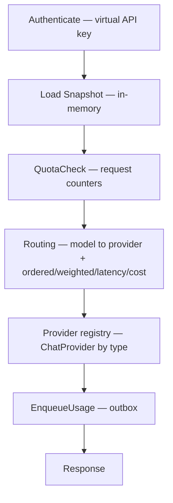
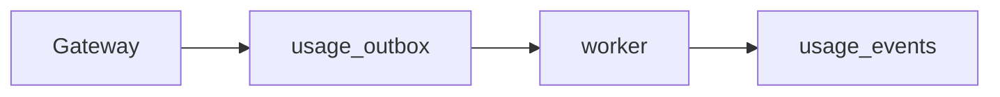

# Architecture

AFI separates **control plane** and **data plane**.

## Principles

1. The control plane owns business rules.
2. The data plane only executes requests.
3. Configuration is immutable at runtime (snapshots).
4. Every request completes without configuration database access (counters/outbox are operational state, not config).
5. Performance and operational simplicity take precedence over architectural purity.
6. New providers register through a stable adapter contract without editing the request pipeline core.

## Control plane

Uses pragmatic domain packages.

Responsibilities today:

* Persist orgs, projects, users, virtual API keys, providers, routes, quotas
* Create organizations and invite existing users by email (org membership roles: owner / admin / member)
* API keys: **personal** (user-scoped) and **service_account** (org- or project-scoped)
* Compile configuration into versioned snapshots (including provider capabilities)
* Platform HTTP APIs (`/api/v1/platform/*`)
* Internal admin (`/internal/v1/*`, `/healthz`)

## Data plane

Implemented as a **request pipeline**:

```mermaid
flowchart TD
  A[Authenticate — virtual API key]
  B[Load Snapshot — in-memory]
  C[QuotaCheck — request counters]
  D[Routing — model to provider + ordered/weighted/latency/cost]
  E[Provider registry — ChatProvider by type]
  F[EnqueueUsage — outbox]
  G[Response]

  A --> B --> C --> D --> E --> F --> G
```

Provider adapters (`openai`, `anthropic`, `gemini`, `bedrock`, `azure_openai`, `elevenlabs`, `openai_compatible`, …) self-register via the provider-type catalog and dataplane factories (`DefaultRegistry`). Chat-capable adapters implement `IRChatProvider`; requests decode through a **client dialect** (`/openai/...`, `/anthropic/...`, or `/gemini/...`) into chat IR, then the adapter speaks the upstream API. Optional modality ports (`AudioBackend`, `EmbeddingsBackend`, `ImagesBackend`) are resolved by registry lookup + capabilities — not hard-coded type allowlists. See [API dialects](../api/dialects.md) and [Providers](providers.md).

Also exposes:

* `GET /openai/v1/models` (alias `/v1/models`) — virtual models from the key’s organization routes, enriched from the curated model catalog
* `POST /openai/v1/chat/completions` (alias `/v1/chat/completions`) — OpenAI dialect via chat IR
* `POST /anthropic/v1/messages` (alias `/v1/messages`) — Anthropic dialect via chat IR (any chat-capable provider)
* `POST /openai/v1/embeddings` (alias `/v1/embeddings`) — OpenAI-compatible embeddings via `EmbeddingsBackend`
* `POST /openai/v1/images/generations` (alias `/v1/images/generations`) — OpenAI-compatible image generation via `ImagesBackend` (optional org object-store persist)
* `POST /openai/v1/audio/speech` / `POST /openai/v1/audio/transcriptions` (aliases `/v1/audio/...`) — TTS/STT via `AudioBackend`
* `POST|GET|DELETE /mcp/{alias}` — MCP Streamable HTTP proxy to org-scoped upstream backends (snapshot `MCPBackends`). Platform UI: [MCP and A2A](../guides/web-ui/mcp-a2a.md).
* `POST /a2a/{alias}` — A2A JSON-RPC proxy; `GET /a2a/{alias}/.well-known/agent-card.json` — Agent Card with gateway URL rewrite (snapshot `A2AAgents`). Platform UI: [MCP and A2A](../guides/web-ui/mcp-a2a.md).

The playground honors streaming/TTS/STT capabilities per model. Chat, Anthropic messages, and audio (TTS/STT) select targets with route `routing_strategy` (`ordered`, `weighted`, `latency`, or `cost`), then retry/failover before the response body is committed to the client.

Pipeline stages stay stateless aside from the in-memory snapshot pointer. Quota counters and the usage outbox use Postgres as operational stores.

## Snapshots

Snapshots contain:

* Virtual API keys (hashes) → org binding, optional project, kind, owner user id
* Providers (type, base URL, API key env ref, capabilities, optional opaque `config`)
* Provider credentials (env ref, encrypted_db ciphertext, or vault secret_ref) + assignments (provider type × org/project/api_key scope)
* Static model routes (optional fallbacks and retry config)
* Optional per-org object store config (S3-compatible asset persistence for image generations)
* Quotas (scope, metric, limit, window) — resolve order per window: api_key → user → project → organization
* CEL request policies (when/then: CEL when + ordered Then actions allow|deny|set_header|use_credential; vars include `request`, `key`, and `credential`)

Stored in Postgres (`gateway_snapshots`). The gateway watches for new versions (poll + `LISTEN/NOTIFY`) and hot-reloads.

## Async usage

```mermaid
flowchart LR
  Gateway --> usage_outbox --> worker --> usage_events
```

The request path never waits on `usage_events` consumers. Run `make run-worker` locally to populate the Usage UI (including `cost_usd` when prices match). Events carry a `modality` (`chat` / `messages` / `tts` / `stt` / `embedding` / `image`, …) and a `metrics` JSON object for non-token quantities; token columns remain for chat pricing. Cost uses DB `model_prices` overrides when present, otherwise the curated catalog in `internal/modelcatalog` (chat $/MTok, TTS $/character, STT $/second, embedding $/MTok, image $/image).

## Extensions (current)

In-process registration is live:

* **Providers** — `sdk/provider.ChatProvider` via `Registry.RegisterSDK` (example: `extensions/echo`)
* **Hooks** — `BeforeCall` / `AfterCall` (all modalities) plus `BeforeChat` / `AfterChat`; tags via `X-AFI-Tags` (`extensions/demohook`; example-only tag limits in `extensions/tagquota`)
* **WASM hooks** — sandboxed TinyGo guests via `internal/adapters/wasm` + org `wasm_hooks` in the snapshot (`AFI_WASM_*` env still works for demos). See [WASM hooks](hooks/wasm.md).
* **Provider health** — control-plane rollup from `usage_events` for Providers UI

Control-plane WASM hook bindings and gateway gRPC extension runtime (ChatProvider + lifecycle hooks via `gateway.grpc_extensions`) are available; auth/secrets/notifications gRPC adapters and billing invoices remain future work.

**Hub-and-spoke regions:** Platform admins register **regions** and **gateway deployments**, bind organizations to regions, and optionally attach **full config overlays** (replace that org’s gateway slice in a region; inherit base when absent). The hub control plane remains the config source of truth. Optional snapshot fan-out (`AFI_SNAPSHOT_DIST_ENABLED` + `AFI_SNAPSHOT_S3_*`) mirrors a global blob plus per-region blobs under `{prefix}/{regionSlug}/`; spokes set `AFI_SNAPSHOT_BACKEND=objectstore` and `AFI_REGION_ID=<slug>` to load their region’s snapshot without sharing the hub config DB. Regional snapshots include an org allowlist; the gateway rejects keys for orgs not on that list. Gateways heartbeat with `AFI_CONTROL_PLANE_URL`, `AFI_DEPLOYMENT_ID`, and `AFI_DEPLOYMENT_JOIN_TOKEN`. Timed quotas use **regional Redis**; lifetime (`total`) quotas use hub Postgres when available (otherwise fail-closed). Spokes can ship usage with `AFI_USAGE_BACKEND=http`. See [Deployment](../deployment/index.md) and [Customization](../deployment/customization.md).

**Control-plane federation:** A regional control plane (`AFI_FEDERATION_MODE=regional`) pulls memberships/overlays/snapshots from the hub. Inference and timed quotas stay in-region; the regional CP rejects management mutations (hub is authoritative). Regional gateways ship usage **reports** to the hub for observation (metrics/logs) without either side treating them as hub-persisted usage rows. Lab: `examples/federation`.

**Protocol gateways:** MCP Streamable HTTP (`/mcp/{alias}`) and A2A JSON-RPC + Agent Card (`/a2a/{alias}`) proxies are shipped. Platform UI: [MCP and A2A](../guides/web-ui/mcp-a2a.md).

**Shipped governance:**

* **Quotas** — `total` windows on Postgres; `minute` / `hour` / `day` rate limits on Redis (`AFI_REDIS_URL`)
* **CEL policies** — when/then rules in the snapshot. When the expression is true, Then `actions` run in order: `deny` stops with 403, `allow` short-circuits allow, `set_header` sets an outbound provider header, `use_credential` selects a secret by name. Credential context: `credential.is_byok`, `credential.id`, `credential.name`, `credential.storage_kind`, `credential.provider_type`.
* **Provider credentials (BYOK)** — org-owned secrets (`env`, AES-GCM `encrypted_db`, or `vault` refs). Assignable to organization, project, or API key scopes. **Policy override:** `use_credential` action picks a credential by **name**; otherwise resolve **api_key → project → org → provider `api_key_env`**. Usage events persist `credential_id` and `used_byok`.