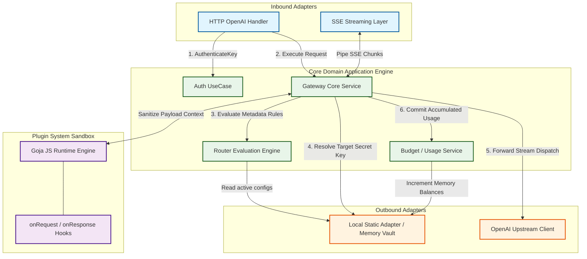
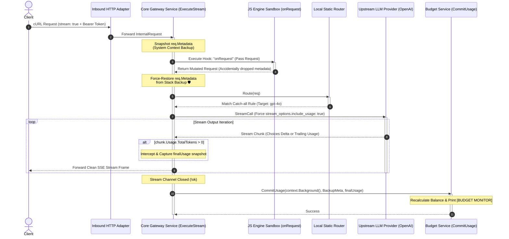

## High-level system components

```mermaid
graph TD
    %% Define Styles
    classDef inbound fill:#e1f5fe,stroke:#01579b,stroke-width:2px;
    classDef core fill:#e8f5e9,stroke:#1b5e20,stroke-width:2px;
    classDef outbound fill:#fff3e0,stroke:#e65100,stroke-width:2px;
    classDef plugin fill:#f3e5f5,stroke:#4a148c,stroke-width:2px;

    %% Inbound Adapters (Driving)
    subgraph Inbound Adapters
        HTTP[HTTP OpenAI Handler]:::inbound
        StreamHandler[SSE Streaming Layer]:::inbound
    end

    %% Hexagonal Core Domain Boundary
    subgraph Core Domain Application Engine
        AuthUC[Auth UseCase]:::core
        GatewaySvc[Gateway Core Service]:::core
        BudgetSvc[Budget / Usage Service]:::core
        RouterSvc[Router Evaluation Engine]:::core
    end

    %% Extensible Sandbox Engine
    subgraph Plugin System Sandbox
        JSEngine[Goja JS Runtime Engine]:::plugin
        Hooks[onRequest / onResponse Hooks]:::plugin
    end

    %% Outbound Adapters (Driven)
    subgraph Outbound Adapters
        LocalStatic[Local Static Adapter / Memory Vault]:::outbound
        OpenAIClient[OpenAI Upstream Client]:::outbound
    end

    %% Dependency Layout Connections
    HTTP -->|1. AuthenticateKey| AuthUC
    HTTP -->|2. Execute Request| GatewaySvc
    StreamHandler <-->|Pipe SSE Chunks| GatewaySvc

    GatewaySvc <-->|Sanitize Payload Context| JSEngine
    JSEngine --- Hooks
    
    GatewaySvc -->|3. Evaluate Metadata Rules| RouterSvc
    RouterSvc -->|Read active configs| LocalStatic
    
    GatewaySvc -->|4. Resolve Target Secret Key| LocalStatic
    GatewaySvc -->|5. Forward Stream Dispatch| OpenAIClient
    
    GatewaySvc -->|6. Commit Accumulated Usage| BudgetSvc
    BudgetSvc -->|Increment Memory Balances| LocalStatic

    %% Apply Layout Classings
    class HTTP,StreamHandler inbound;
    class AuthUC,GatewaySvc,BudgetSvc,RouterSvc core;
    class LocalStatic,OpenAIClient outbound;
    class JSEngine,Hooks plugin;
```

### User flow 

```mermaid
sequenceDiagram
    autonumber
    actor Client
    participant HTTP as Inbound HTTP Adapter
    participant Core as Core Gateway Service (ExecuteStream)
    participant JS as JS Engine Sandbox (onRequest)
    participant Router as Local Static Router
    participant Vendor as Upstream LLM Provider (OpenAI)
    participant Budget as Budget Service (CommitUsage)

    Client->>HTTP: cURL Request (stream: true + Bearer Token)
    HTTP->>Core: Forward InternalRequest
    activate Core
    Note over Core: Snapshot req.Metadata<br/>(System Context Backup)
    
    Core->>JS: Execute Hook: "onRequest" (Pass Request)
    activate JS
    JS-->>Core: Return Mutated Request (Accidentally dropped metadata)
    deactivate JS
    
    Note over Core: Force-Restore req.Metadata<br/>from Stack Backup 🛡️
    
    Core->>Router: Route(req)
    activate Router
    Router-->>Core: Match Catch-all Rule (Target: gpt-4o)
    deactivate Router

    Core->>Vendor: StreamCall (Force stream_options.include_usage: true)
    activate Vendor
    
    loop Stream Output Iteration
        Vendor-->>Core: Stream Chunk (Choices Delta or Trailing Usage)
        alt chunk.Usage.TotalTokens > 0
            Note over Core: Intercept & Capture finalUsage snapshot
        end
        Core-->>Client: Forward Clean SSE Stream Frame
    end
    deactivate Vendor

    Note over Core: Stream Channel Closed (!ok)
    Core->>Budget: CommitUsage(context.Background(), BackupMeta, finalUsage)
    activate Budget
    Note over Budget: Recalculate Balance & Print [BUDGET MONITOR]
    Budget-->>Core: Success
    deactivate Budget
    
    deactivate Core
```