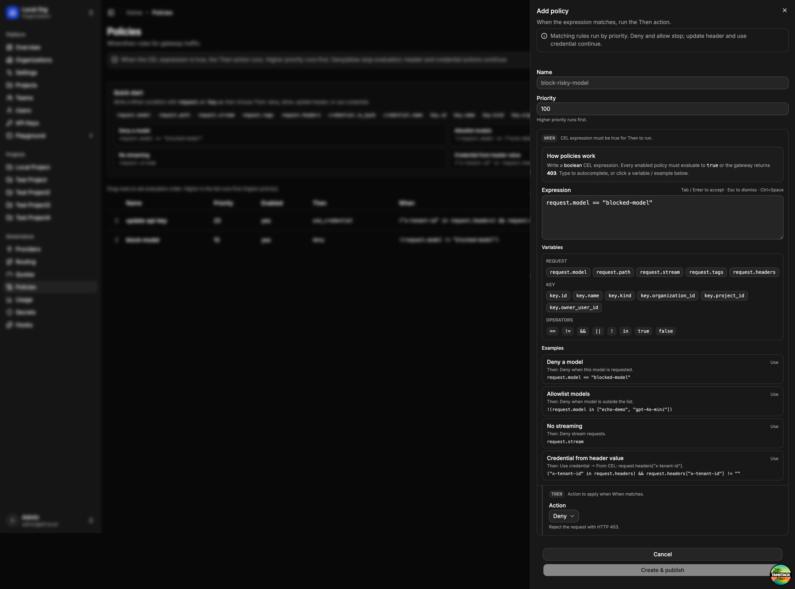

# Web UI

The platform UI is the browser console for operating AFI: identity and access, gateway configuration, and a built-in playground. It talks to the control plane for admin APIs and can call the gateway for chat, TTS, and STT.


## What you can do

* **Organizations & access** — switch orgs, manage projects, teams, users, and invites
* **API keys** — create personal or service-account keys for the gateway
* **Providers & routing** — register upstream providers and define model routes (including failover)
* **Quotas & policies** — set usage limits and CEL when/then rules that the gateway enforces
* **Secrets & hooks** — manage credentials and extension hooks used by the platform
* **Usage** — filter requests by project, key, modality, and model; inspect volume, tokens, cost, and per-request logs
* **Playground** — try chat, text-to-speech, and speech-to-text against your live gateway

## Policies

Open **Operations → Policies** to create custom request policies. Org owners and admins can add, edit, reorder, enable/disable, and delete policies. Creating or updating a policy publishes a new gateway snapshot so the change takes effect on the next request.



Each policy is a **when / then** rule:

1. **Name & priority** — higher priority runs first (default `100`). Drag rows in the table to reorder.
2. **When** — a boolean [CEL](https://cel.dev/) expression. The policy runs only when the expression is `true`.
3. **Then** — the action to take when the expression matches.

### How evaluation works

Matching rules run in priority order (highest first):

* **Deny** — stop and reject with HTTP 403 (`policy_violation`)
* **Allow** — stop and allow (skips lower-priority rules)
* **Update header** / **Use credential** — apply the change and continue to the next matching rule

Disabled policies are ignored. If no deny/allow rule stops evaluation, the request continues through the rest of the gateway pipeline.

### Writing the When expression

Use the expression editor chips to insert variables and operators, or pick an example to start from.

| Group | Variables |
|-------|-----------|
| Request | `request.model`, `request.path`, `request.stream`, `request.tags`, `request.headers` |
| Key | `key.id`, `key.name`, `key.kind`, `key.organization_id`, `key.project_id`, `key.owner_user_id` |
| Credential | `credential.is_byok`, `credential.name` |

Notes:

* `request.headers` keys are lowercased; `authorization` and `cookie` are omitted.
* `request.tags` comes from the `X-AFI-Tags` header (string → string map).
* Common operators: `==`, `!=`, `&&`, `||`, `!`, `in`.

### Then actions

| Action | What it does |
|--------|----------------|
| **Deny** | Reject the request with HTTP 403 |
| **Allow** | Short-circuit allow; skip lower-priority rules |
| **Update header** | Set an outbound header on the upstream provider request (static value or CEL `value_expr`) |
| **Use credential** | Select a named secret for this request (fixed name or CEL `credential_name_expr`) |

Credential resolve order when a policy selects one: **policy use_credential → api_key → project → organization → provider `api_key_env`**. Unknown credential names fail closed. Manage secrets under **Secrets** before referencing them from a policy.

### Example policies

| Goal | When | Then |
|------|------|------|
| Block a model | `request.model == "blocked-model"` | Deny |
| Allowlist models | `!(request.model in ["echo-demo", "gpt-4o-mini"])` | Deny |
| Ban streaming | `request.stream` | Deny |
| Partner key from header | `("x-tenant-id" in request.headers) && request.headers["x-tenant-id"] != ""` | Use credential → From CEL: `request.headers["x-tenant-id"]` |
| Fixed partner key | header equals a known tenant | Use credential → credential name `partner-acme` |
| Tag upstream | any matching when | Update header `X-Partner` from a static value or CEL expression |

Click **Create & publish** (or save when editing) to persist and publish. API field details: [Config reference — CEL policies](../development/config-reference.md#cel-policies).

## Run locally

With the control plane (and optionally the gateway + worker) already running:

```bash
pnpm --dir web install
pnpm --dir web dev
```

Open http://localhost:3000 and sign in with the seed user (`admin@afi.local` / `admin`), or with a configured [SSO](sso.md) provider. Full stack steps: [Local development](local-dev.md).
