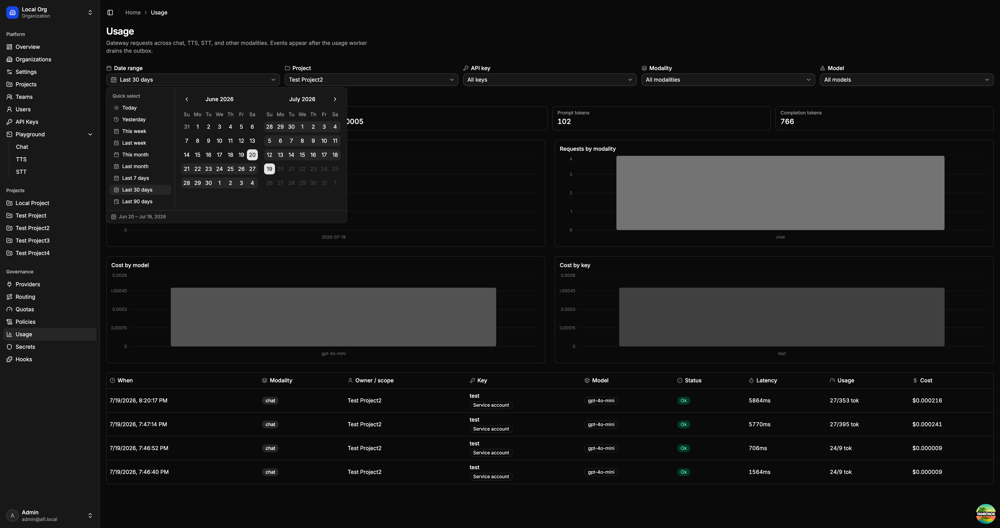

# Web UI

The platform UI is the browser console for operating AFI: identity and access, gateway configuration, and a built-in playground. It talks to the control plane for admin APIs and can call the gateway for chat, TTS, and STT.



## What you can do

* **Organizations & access** — switch orgs, manage projects, teams, users, and invites
* **API keys** — create personal or service-account keys for the gateway
* **Providers & routing** — register upstream providers and define model routes (including failover)
* **MCP & A2A** — register protocol gateway upstreams and test connectivity ([MCP and A2A](web-ui/mcp-a2a.md))
* **Quotas** — set usage limits the gateway enforces
* **Policies** — CEL when/then request rules ([Policies](web-ui/policies.md))
* **Secrets & hooks** — manage credentials and extension hooks used by the platform
* **Usage** — filter requests by project, key, modality, and model; inspect volume, tokens, cost, and per-request logs
* **Playground** — try chat, text-to-speech, speech-to-text, and MCP tools against your live gateway

## Run locally

With the control plane (and optionally the gateway + worker) already running:

```bash
pnpm --dir web install
pnpm --dir web dev
```

Open http://localhost:3000 and sign in with the seed user (`admin@afi.local` / `admin`), or with a configured [SSO](sso.md) provider. Full stack steps: [Local development](local-dev.md).
