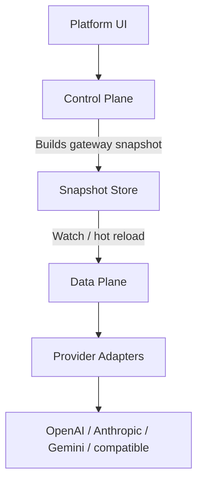

  

# AFI

AFI is a self-hostable, cloud-native **LLM gateway**.

It has two major parts:

* **Control plane** — configuration, identities, policies, quotas, routing, and platform APIs. Owns business rules and compiles **immutable snapshots**.
* **Data plane (gateway)** — processes inference with a request pipeline. Loads snapshots and never queries the configuration database during a request.

Start here: [Local development](getting-started/local-dev.md). Platform console: [Web UI](getting-started/web-ui.md). Platform SSO: [Single sign-on](getting-started/sso.md). Self-hosting: [Deployment](deployment.md).

## High-level flow

## What works locally today

* Postgres + Adminer via `make dev-up`
* Control plane: migrate, seed, snapshot publish, platform auth, org create + member invite
* Personal and service-account API keys; quotas on org / project / user / api_key
* Gateway: virtual API key auth → quotas → routes (with failover) → provider registry
* OpenAI-compatible `POST /v1/chat/completions` and `GET /v1/models` (`supports_streaming` / `supports_tts` / `supports_stt`)
* Native Anthropic `POST /v1/messages` (Anthropic providers / routes)
* OpenAI-compatible `POST /v1/audio/speech` and `POST /v1/audio/transcriptions` (openai / openai_compatible)
* Streaming for OpenAI, Anthropic, Gemini, and `openai_compatible` (capability-gated)
* Usage outbox + worker with optional `cost_usd`
* Web UI: Providers, Routing, MCP, A2A, Keys, Quotas, Policies, chat/TTS/STT playground against the gateway
* Docs via `make doc-serve`
