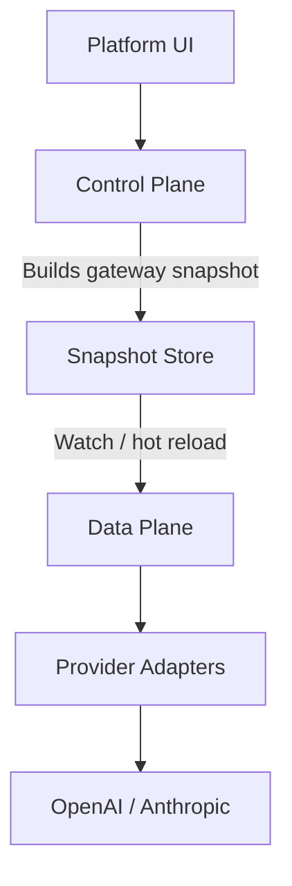

# AFI

AFI is a self-hostable, cloud-native **LLM gateway**.

It has two major parts:

* **Control plane** — configuration, identities, policies, quotas, routing, and platform APIs. Owns business rules and compiles **immutable snapshots**.
* **Data plane (gateway)** — processes inference with a request pipeline. Loads snapshots and never queries the configuration database during a request.

Start here: [Local development](getting-started/local-dev.md).

## High-level flow

## What works locally today

* Postgres + Adminer via `make dev-up`
* Control plane: migrate, seed, snapshot publish, platform auth APIs
* Gateway: virtual API key auth → route → OpenAI chat completions (stream + non-stream)
* Web UI against the control plane (`:8081`)
* Docs via `make doc-serve`
